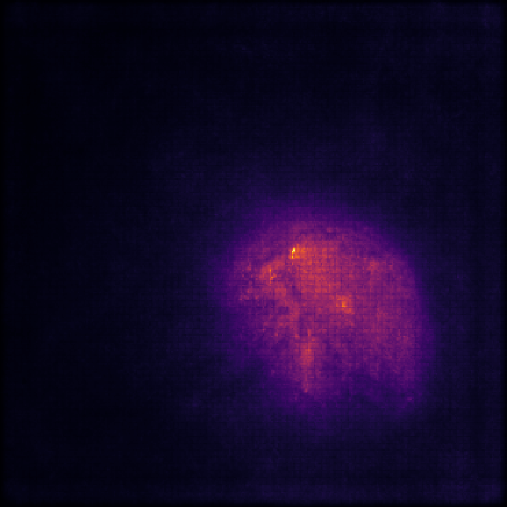
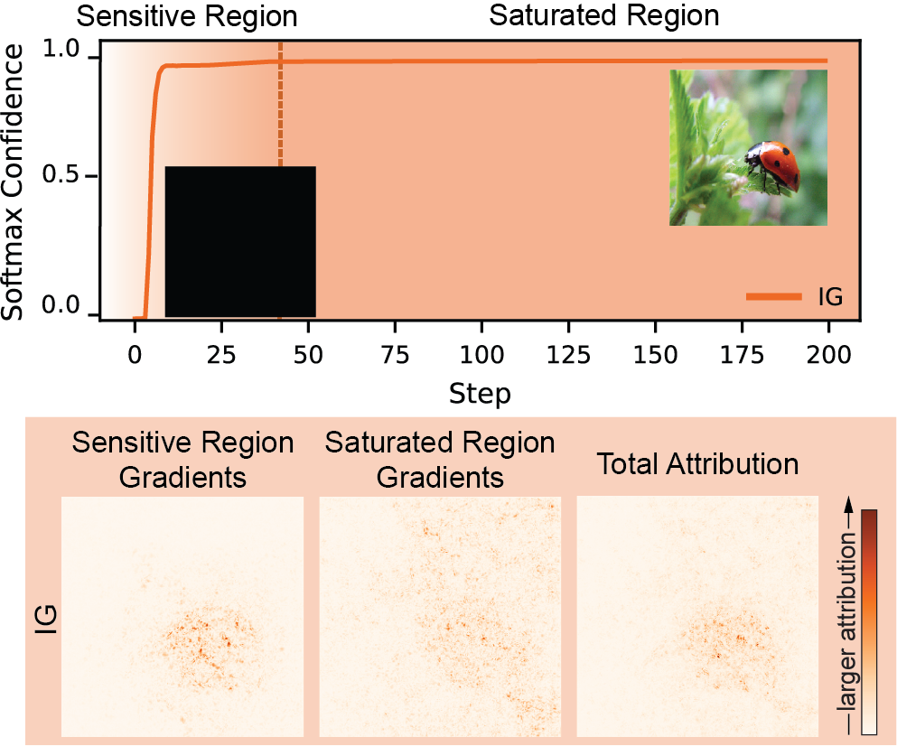
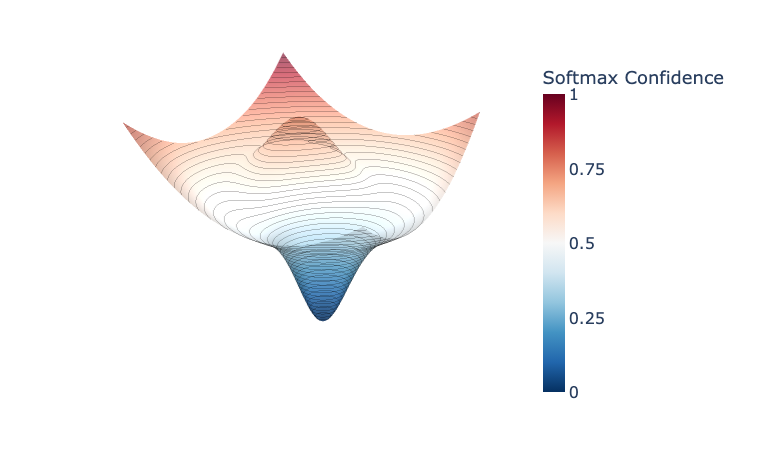
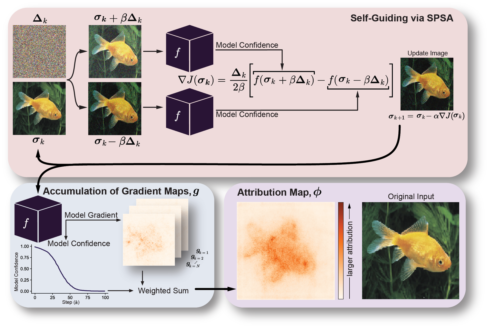
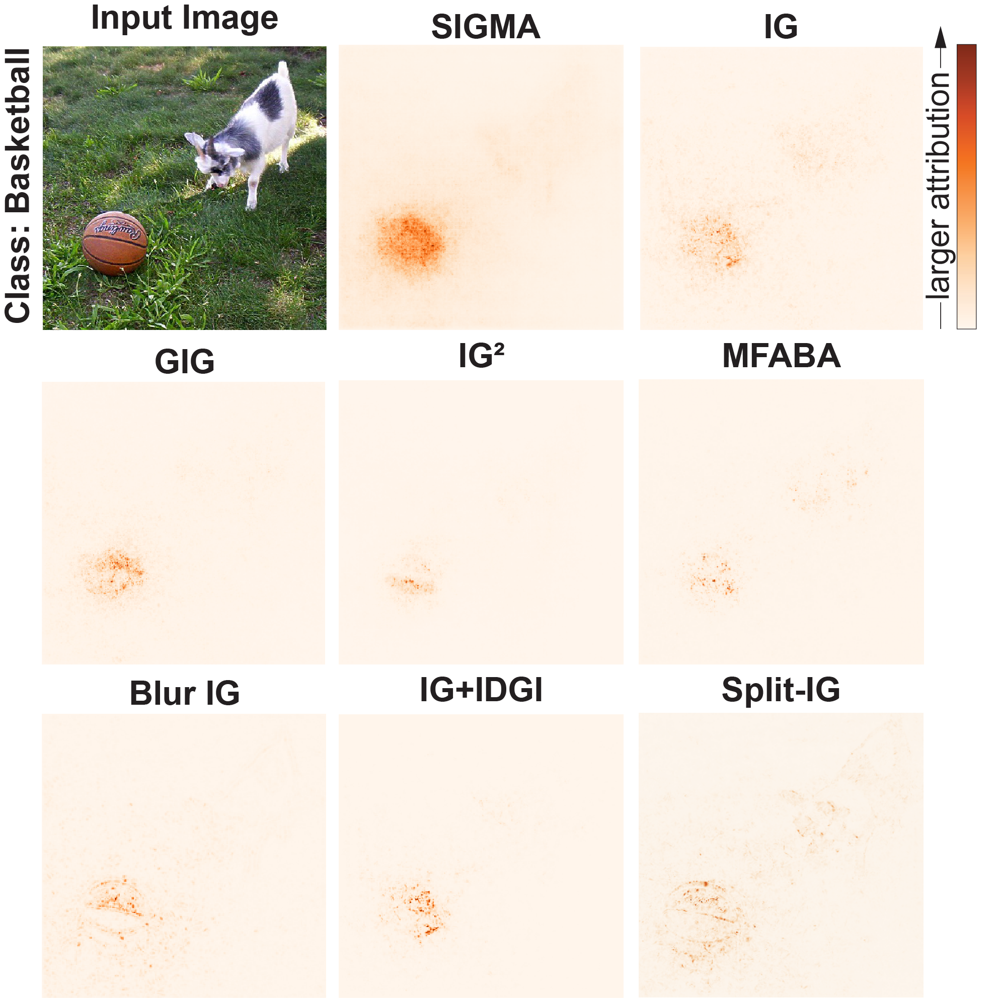
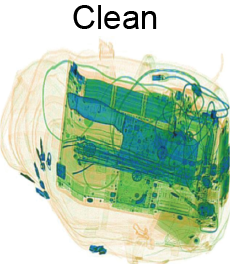
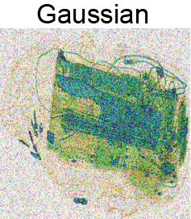
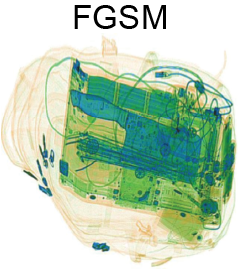
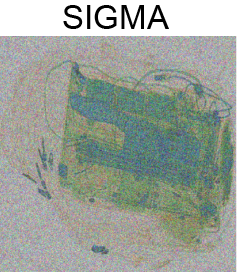
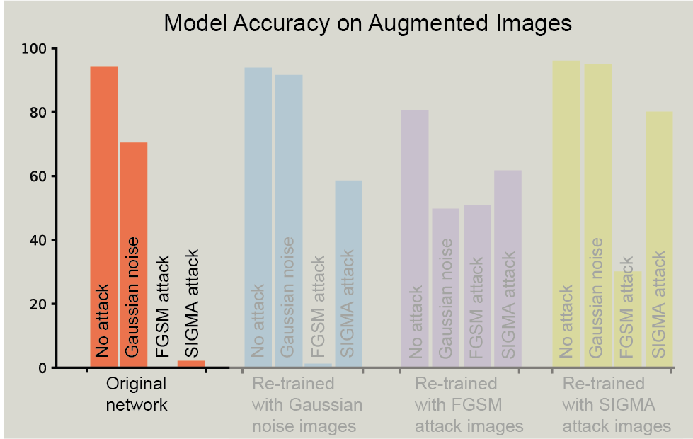

Modern neural networks can have very high confidence — but confidence alone does not tell us *why* a prediction was made.

Feature attribution methods aim to answer this *why* by highlighting which parts of an input most influenced a model's decision. In practice, however, the way we choose to explain a prediction can actually shape the explanation itself.

## What does it mean to explain a prediction?

Given an input and a trained model, an attribution method assigns importance scores to individual input features — pixels in an image, time points on a graph, or tokens in text — indicating how strongly each contributed to the final prediction.

Among the most widely used approaches are *path-based* methods, which accumulate model gradients as the input is gradually transformed, telling us how sensitive each input feature is to the output prediction.



  

    
    
  

  <button class="toggle-btn" onclick="toggleAttribution(this)">Click to Show Attribution</button>
  <figcaption>The model predicted the class 'Ladybug' for this input image, click to highlight which pixels were most important in this prediction.</figcaption>



## The baseline assumption

Integrated Gradients explains a prediction by integrating gradients along a straight path from a *baseline* input to the image being explained. The baseline is intended to represent the absence of information — often a black or blurred image. However, different baselines can lead to noticeably different explanations, even when the model and input remain unchanged.


<figure class="interactive-figure" data-figure="baseline-1">
  

    
    
  

  

    <button class="toggle-btn baseline-btn" aria-pressed="true" data-src="Interactive_figs/IG_black_baseline.png" onclick="setBaseline(this)">Black</button>
    <button class="toggle-btn baseline-btn" aria-pressed="false" data-src="Interactive_figs/IG_noise_baseline.png" onclick="setBaseline(this)">Noise</button>
    <button class="toggle-btn baseline-btn" aria-pressed="false" data-src="Interactive_figs/IG_blur_baseline.png" onclick="setBaseline(this)">Blurred</button>
  

  <figcaption>Integrated Gradients attribution for the same input using different baselines.</figcaption>
</figure>


## Saturation along attribution paths

As the input moves away from the baseline, the model's confidence often increases rapidly before entering a saturated region where further changes have little effect on the output. Gradients accumulated in these flat regions can dominate the final attribution, despite contributing little to the actual decision.


<figure class="interactive-figure figure-large">
  

    
  

</figure>


## Thinking in terms of confidence landscapes

Rather than viewing attribution as interpolation between two images, it can be helpful to think of the model's output as a *confidence landscape* over input space. An informative explanation should focus on the regions where the model's belief actually changes — not where it is already certain.


<figure class="interactive-figure figure-large">
  

    
  

</figure>


## A self-guided path

SIGMA removes the need for a baseline entirely. Instead of following a predefined path, SIGMA constructs its own trajectory by iteratively perturbing the input in directions that reduce the model's confidence in the predicted class. Gradients are accumulated along this path and weighted by the corresponding drop in confidence.


<figure class="interactive-figure figure-video">
  

    <video class="article-video" autoplay muted loop playsinline controls preload="auto">
      <source src="Interactive_figs/sigma_side_by_side.mp4" type="video/mp4">
      Sorry — your browser can't play this video.
    </video>
  

  <figcaption>SIGMA trajectory through a prediction landscape with corresponding perturbed input and attribution evolution.</figcaption>
</figure>

<figure class="interactive-figure figure-method">
  

    
  

</figure>


## What changes in practice?

Because SIGMA follows the model's confidence downhill, it avoids early saturation and continues to collect informative gradients throughout the path. The resulting attribution maps tend to be more spatially coherent and less influenced by regions that have little effect on the prediction.


<figure class="interactive-figure figure-large">
  

    
  

</figure>


## Faithfulness to model behaviour

By accumulating gradients in proportion to confidence change, SIGMA aligns attribution strength with the model's sensitivity. Revealing input features in order of attribution importance reconstructs the model's confidence more efficiently than random or saturated-gradient explanations.

## Beyond explanation

Following confidence collapse naturally produces perturbed inputs that remain recognisable to humans but receive near-zero confidence from the model. These low-confidence variants expose decision boundaries and can be reused as training augmentations, linking interpretability and model reliability.



  

    <button class="perturb-btn is-active" data-mode="clean" aria-selected="true">
      
    </button>
    <button class="perturb-btn" data-mode="gaussian" aria-selected="false">
      
    </button>
    <button class="perturb-btn" data-mode="fgsm" aria-selected="false">
      
    </button>
    <button class="perturb-btn" data-mode="sigma" aria-selected="false">
      
    </button>
  

  <figure class="chart-figure">
    
    <figcaption id="chartCap">Original network performance (Clean)</figcaption>
  </figure>



## Conclusion

SIGMA offers a shift in perspective for attribution based interpretability — from explaining predictions relative to arbitrary references, to explaining them by following the model's own confidence. By treating explanations as paths shaped by the model itself, we gain both clearer attributions and a deeper understanding of how confidence emerges and collapses.





---

**Paper:** [Preprint on TechRxiv](https://www.techrxiv.org/doi/full/10.36227/techrxiv.175037106.61341481)  
**Code:** [GitHub repository](https://github.com/HWQuantum/SIGMA)  
**Contact:** [sjh9@hw.ac.uk](mailto:sjh9@hw.ac.uk)

